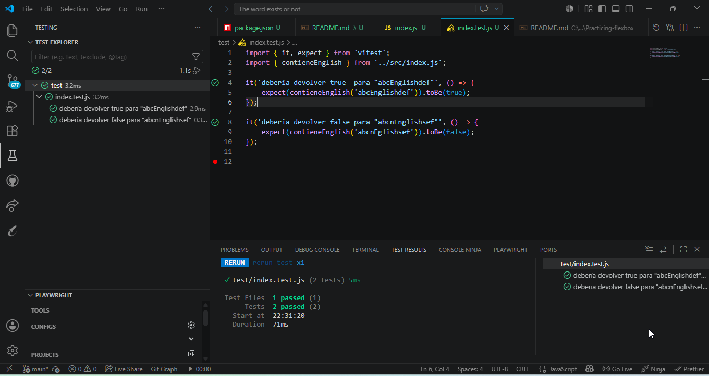

# 🚀 Exercise - JavaScript - String Validator (English Keyword)

Repositorio creado para el entrenamiento y perfeccionamiento en el uso de métodos de strings, normalización de datos y pruebas automatizadas con **Vitest**.

---

# 📖 Descripción

Este proyecto consiste en el desarrollo de una función lógica capaz de determinar si una cadena de texto (string) contiene la palabra completa "English". El sistema  debe cumplir con:

* **Insensibilidad a mayúsculas:** "eNglisH" es detectado como "English".
* **Orden estricto:** Solo devuelve verdadero si la secuencia de caracteres forma la palabra completa.
* **Validación booleana:** Retorna `true` si la palabra está presente, `false` en caso contrario.

---

# 🧠 Algoritmo de Solución

Para resolver este problema, se ha seguido el siguiente flujo lógico:

1. Establecer texto a base
2. Leer la cadena de texto
3. El sistema analiza la secuencia de caracteres del string para localizar la subcadena exacta 'English'
4. Leer o identificar si está escrita la palabra english
5. Devolver TRUE Ó FALSE me confirmas si está bien para el ejercicio 

---

# 🧪 Testing (Vitest)

El algoritmo ha sido verificado mediante una suite de pruebas automatizadas que cubren los casos solicitados:

* **Caso Positivo:** Validación de la palabra en diferentes posiciones y formatos (ej.`"abcEnglishdef" ó "eNglisH"`).
* **Caso Negativo:** Verificación de que secuencias rotas o caracteres alterados devuelven `false` (ej. `"abcnEglishsef"`).

---

# 🛠️ Tecnologías

* JavaScript (ES6+)
* Vitest (Testing Framework)
* Node.js
* Git & GitHub

---

# 👨‍💻 Autora

Proyecto desarrollado por:
* **Luisa María Cortés**

Training Developer · F5 Bootcamp
asd