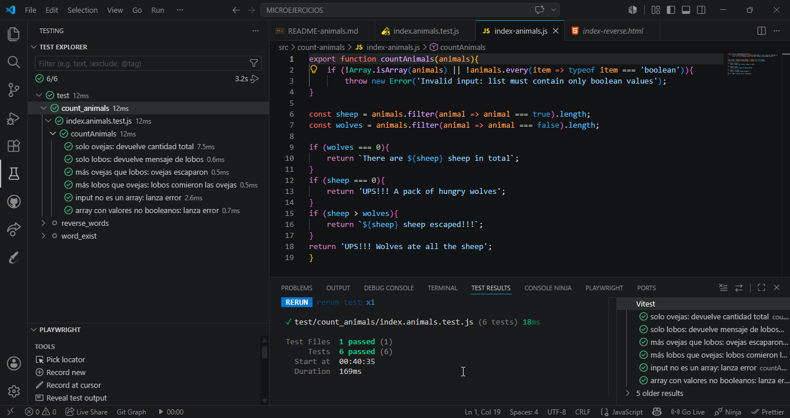

# Ejercicio: Counting Sheep 🐑

🔗 [Repositorio](https://github.com/lcortes89/ex-p5-digital-academy-javascript-micro-exercises)

## Descripción del problema

El objetivo es implementar una función que reciba una lista de valores booleanos y determine cuántas ovejas hay, o si los lobos se las han comido.

## Reglas de negocio

* **`true`** representa una oveja y **`false`** representa un lobo.
* **Solo ovejas:** Si no hay lobos, devuelve el total de ovejas.
* **Solo lobos:** Si no hay ovejas, devuelve un mensaje de alerta.
* **Más ovejas que lobos:** Algunas ovejas escaparon.
* **Más lobos que ovejas:** Los lobos se comieron todas las ovejas.
* **Input inválido:** Si el argumento no es un array o contiene valores no booleanos, lanza un error.

## Ejemplos de uso

| Entrada | Salida |
| :--- | :--- |
| `[true, true]` | `"There are 2 sheep in total"` |
| `[false, false, false]` | `"UPS!!! A pack of hungry wolves"` |
| `[true, true, false]` | `"2 sheep escaped!!!"` |
| `[false, false, true]` | `"UPS!!! Wolves ate all the sheep"` |
| `"hola"` | `Error: Invalid input: list must contain only boolean values` |
| `[1, 2, 3]` | `Error: Invalid input: list must contain only boolean values` |

## Tecnologías

- JavaScript (ES6 Modules)
- Vitest (Testing unitario)

## Instalación y ejecución

### Requisitos previos
Tener instalado [Node.js](https://nodejs.org/).

### Pasos
1. Clona el repositorio:
```bash
   git clone https://github.com/lcortes89/ex-p5-digital-academy-javascript-micro-exercises.git
```
2. Instala las dependencias:
```bash
   npm install
```
3. Ejecuta los tests:
```bash
   npm test
```

## Tests



## Estructura del proyecto

```
MICROEJERCICIOS/
├── assets/
│   └── img/
│       └── test-count.png
├── src/
│   └── count-animals/
│       └── index-animals.js
├── test/
│   └── count_animals/
│       └── index.animals.test.js
├── package.json
├── vitest.config.js
└── .gitignore
```

## 👩‍💻 Autora

Proyecto desarrollado por:
* **Luisa María Cortés**

Training Developer · F5 Bootcamp