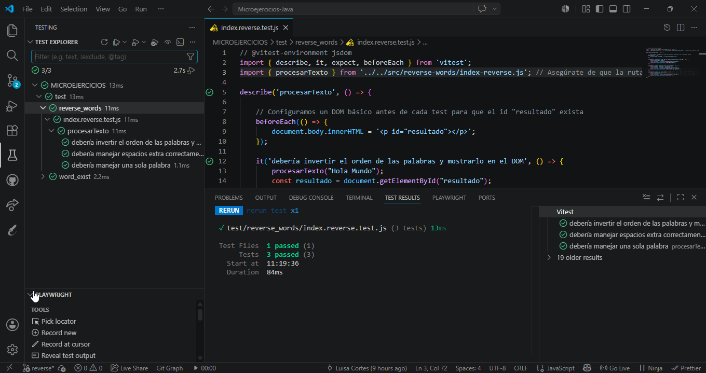

# Ejercicio: Inversor de Palabras

🔗 [Repositorio] (https://github.com/lcortes89/ex-p5-digital-academy-javascript-micro-exercises) · [GitHub Pages](https://TU_USUARIO.github.io/TU_REPOSITORIO)

## Descripción del problema
El objetivo es implementar una función que invierta el orden de las palabras en una cadena de texto (*string*). El programa debe ser capaz de procesar cadenas con formato irregular, asegurando que el resultado final sea limpio y coherente.

## Reglas de negocio
* **Inversión:** El orden de las palabras debe invertirse (la última pasa a ser la primera).
* **Limpieza de datos:** Se deben eliminar los espacios en blanco redundantes al inicio y al final (*trailing/leading spaces*).
* **Espacios intermedios:** Si existen múltiples espacios entre palabras, el resultado final debe consolidarlos en un único espacio.
* **Puntuación:** Los signos de puntuación se consideran parte de la palabra a la que acompañan.
* **Casos especiales:** Una cadena vacía o que solo contiene espacios debe devolver una cadena vacía.

## Ejemplos de uso
| Entrada | Salida |
| :--- | :--- |
| `"Hello World"` | `"World Hello"` |
| `"Hi There."` | `"There. Hi"` |
| `"    espacios al rededor    "` | `"rededor al espacios"` |
| `"Muchos     espacios       intermedios"` | `"intermedios espacios Muchos"` |

## Tecnologías
- JavaScript (ES6 Modules)
- Vitest (Testing unitario)


## Instrucciones de ejecución

Para poner en marcha este ejercicio, sigue estos pasos desde la terminal en la raíz del proyecto:

markdown

## Instalación y ejecución

### Requisitos previos
Tener instalado [Node.js](https://nodejs.org/).

### Pasos
1. Clona el repositorio:
```bash
   git clone https://github.com/lcortes89/ex-p5-digital-academy-javascript-micro-exercises
```
2. Instala las dependencias:
```bash
   npm install
```
3. Ejecuta los tests:
```bash
   npm test


## Tests



## Estructura del proyecto

```
MICROEJERCICIOS-JAVA/
├── assets/
├── src/
│   ├── reverse-words/
│   │   ├── index-reverse.html
│   │   ├── index-reverse.js
│   └────── README-reverse.md
│
├── test/
│   ├── reverse_words/
│   │   └── index.reverse.test.js
│   └── word_exist/
│
├── image.png
├── package-lock.json
├── package.json
├── README.md
├── vitest.config.js
└── .gitignore
```

 ## 👨‍💻 Autora

Proyecto desarrollado por:
* **Luisa María Cortés**

Training Developer · F5 Bootcamp